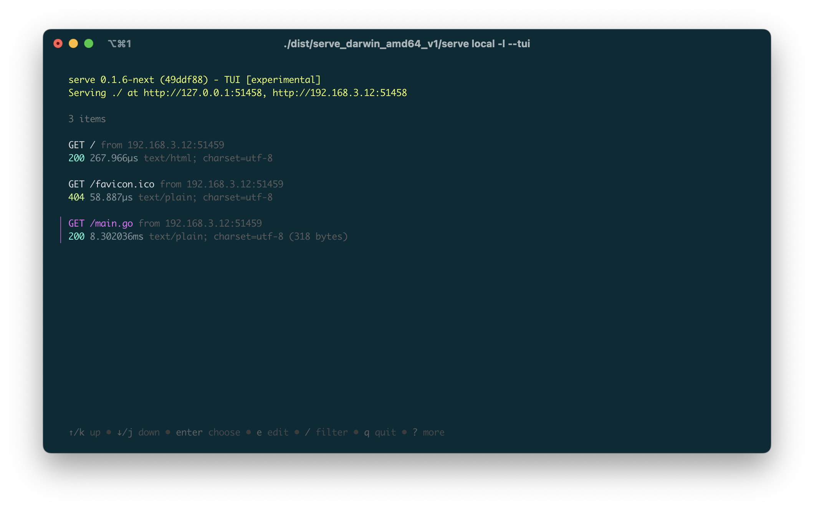

<h1 align="center">
  <br>
  
  <br>
  serve
  <br>
</h1>

<h4 align="center">Easily expose any content on your<br/>computer through a local web server.</h4>

<p align="center">
  <a href="https://github.com/planta7/serve/actions/workflows/ci.yaml">
    
  </a>
  <a href="https://github.com/planta7/serve/actions/workflows/release.yaml">
    
  </a>
  <a href="https://pkg.go.dev/github.com/planta7/serve">
    
  </a>
</p>

<p align="center">
  <a href="#key-features">Key features</a> •
  <a href="#installation">Installation</a> •
  <a href="#usage">Usage</a> •
  <a href="#configuration">Configuration</a> •
  <a href="#want-to-contribute">Want to contribute?</a> •
  <a href="#license">License</a>
</p>


### Key features

+ Create a local HTTP server from any directory
+ Bind any local address to the server
+ Customize it with global or configuration files, environment variables or flags
+ TLS support with optional embedded certificate
+ Configure CORS with a simple flag

### Installation
---

#### Manual install
You can download the latest release binaries available in the
[releases section](https://github.com/planta7/serve/releases/latest) of the repository.

> **Warning**
> Keep in mind that if you install it manually, you will not have the ability to update automatically when there
> is a new version of `serve`.

#### Package manager
In macOS/Windows environments you can install `serve` using [Homebrew](https://brew.sh):

```shell
brew install planta7/tap/serve
```

If you are on a Windows machine, you can use [Chocolatey](https://chocolatey.org):

```shell
choco install serve-cli
```

#### Install from sources

```shell
$ git clone https://www.github.com/planta7/serve.git
$ cd serve
$ go build
```

> **Note**
> Requires GO >= 1.19


### Usage
---

To start a server in the current path, simply run `$ serve local`. In addition to the _TL;DR_ execution,
there are also a number of options that you can configure to suit your needs:

```shell
Usage:
  serve local [path] [flags]

Aliases:
  local, l

Flags:
      --auto-tls           Start with embedded certificate (default is false)
      --cert-file string   Path to certificate (default is empty)
  -c, --cors               Enable CORS (default is false)
  -h, --help               help for local
      --host string        Server host (default is empty)
      --key-file string    Path to key (default is empty)
  -l, --launch             Launch default browser  (default is false)
  -p, --port int           Listen on port (default is random)
      --tui                Launch with TUI (experimental)

Global Flags:
      --config string   config file (default is ./serve and $HOME/.serve)
  -v, --verbose         verbose mode (default is false)
```

#### Examples

To start a local server on port `8080` and automatically launch the system's default browser use the following command:

```shell
serve local -p 8080 -l
```

`serve` will bind the server to the `loopback` address in addition to the private IP that is configured on the system's
default interface. If you want to bind the server to a specific IP, use the command:

```shell
serve local --host 192.168.3.12
```

The above examples start an HTTP server, but if you need to launch an HTTPS server, you can easily do so by providing
the certificate file and its key:

```shell
serve local --cert-file /path/to/cert-file --key-file /path/to/key-file
```

Or if you prefer, you can let `serve` generate a self-signed certificate and key randomly at startup.

```shell
serve local --auto-tls
```

If you are using embedded or self-signed certificates you will receive a security alert in the browser indicating that the
certificate is not trusted, you can safely ignore the warning, or you can provide a valid certificate to `serve`.

Whatever the combination of parameters, `--verbose` or `-v` flag enables detailed output of what is happening on
the server.

> **Note**
> Bonus tip! You can use flags in a more elegant way if you chain them together.
> ```shell
> serve local -clvp 8080
> # is equivalent to
> serve local -c -l -v -p 8080
> # and
> serve local --cors --launch --verbose --port 8080
> ```

#### TUI (experimental)

I am developing a TUI (text user interface) for the next version of `serve`. This interface, besides presenting the
information in a more attractive way, will also bring a lot of new functionalities for capturing and modifying server
requests. Here's a sneak preview:



### Configuration
---

You can configure `serve` using flags, but you also have other options:

+ `.serve` configuration file (here is an [example](.serve.sample))
  + Current directory (local)
  + `$HOME` directory (global)
  + Specified by the flag `--config`
+ Using environment variables
  + `SERVE_AUTO_TLS`
  + `SERVE_CERT_FILE`
  + `SERVE_CORS`
  + `SERVE_HOST`
  + `SERVE_KEY_FILE`
  + `SERVE_LAUNCH`
  + `SERVE_PORT`
  + `SERVE_TUI`

Priority for applying the value to parameters is as follows:

1. Flags
2. Environment variables
3. Configuration file
   1. Specified by `--config`
   2. Local
   3. Global
4. Defaults

The result will be a merge after applying the above order.

> **Note**
> You can check the value of the parameters by starting `serve` with `-v` or `--verbose`.

### Want to contribute?
---

Check out [`CONTRIBUTING.md`](CONTRIBUTING.md) documentation.


### License
---

MIT Licensed. Checkout [`LICENSE`](LICENSE) for more details.
