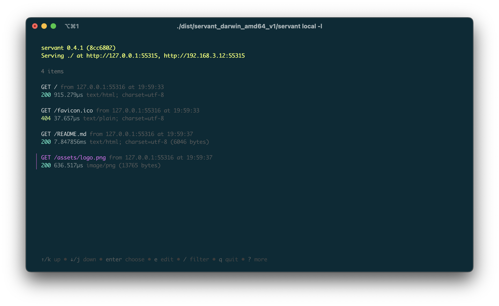

<h1 align="center">
  <br>
  
  <br>
  servant
  <br>
</h1>

<h4 align="center">Easily create a local server for your files<br/>and expose it to the internet through localtunnel.</h4>
<h4 align="center">You can also expose any server running locally ;)</h4>

<p align="center">
  <a href="https://github.com/planta7/servant/actions/workflows/ci.yaml">
    
  </a>
  <a href="https://github.com/planta7/servant/actions/workflows/release.yaml">
    
  </a>
  <a href="https://pkg.go.dev/github.com/planta7/servant">
    
  </a>
</p>

<p align="center">
  <a href="#key-features">Key features</a> •
  <a href="#installation">Installation</a> •
  <a href="#usage">Usage</a> •
  <a href="#configuration">Configuration</a> •
  <a href="#want-to-contribute">Want to contribute?</a> •
  <a href="#license">License</a>
</p>



### Key features

+ Create a local HTTP server from any directory and expose it to Internet
+ Expose any server already running locally
+ Linux, MacOS and Windows binaries
+ Bind any local address to the server
+ Customize it with global or configuration files, environment variables or flags
+ Support for basic authentication
+ TLS support with optional embedded certificate
+ Configure CORS with a simple flag
+ Supercharged TUI with advanced features

### Installation
---

#### Manual installation
You can download the latest release binaries available in the
[releases section](https://github.com/planta7/servant/releases/latest) of the repository.

> **Warning**
> Keep in mind that if you install it manually, you will not have the ability to update automatically when there
> is a new version of `servant`.

#### Package manager
In macOS/Linux environments you can install `servant` using [Homebrew](https://brew.sh):

```shell
brew install planta7/tap/servant
```

#### Install from sources

```shell
$ git clone https://www.github.com/planta7/servant.git
$ cd servant
$ go build ./...
```

> **Note**
> Requires GO >= 1.20

#### Binaries
You can download the binaries from the [releases](https://github.com/planta7/servant/releases) page, currently this is the only way to install it on Windows systems.

### Usage
---

To start a server in the current path, simply run `$ servant local`. In addition to the _TL;DR_ execution,
there are also a number of options that you can configure to suit your needs:

```shell
Usage:
  servant local [path] [flags]

Aliases:
  local, l

Flags:
      --auth string        username:password for basic auth (default is empty)
      --auto-tls           Start with embedded certificate (default is false)
      --cert-file string   Path to certificate (default is empty)
  -c, --cors               Enable CORS (default is false)
  -e, --expose             Expose through localtunnel (default is false)
  -s, --subdomain          Subdomain (default is random)
  -h, --help               help for local
      --host string        Server host (default is empty)
      --key-file string    Path to key
  -l, --launch             Launch default browser (default is false)
  -p, --port int           Listen on port (default is random)

Global Flags:
      --config string   config file (default is ./servant and $HOME/.servant)
      --disable-tui     Disable TUI (default is false)
  -v, --verbose         verbose mode (default is false)
```

> [!IMPORTANT]
> There is also the powerful remote command that allows you to expose a local server in the same way you do with ngrok
> and for which I have not yet been able to write documentation. You can see all the options by running `server remote -h`.

#### Examples

To start a local server on port `8080` and automatically launch the system's default browser use the following command:

```shell
servant local -p 8080 -l
```

`servant` will bind the server to the `loopback` address in addition to the private IP that is configured on the system's
default interface. If you want to bind the server to a specific IP, use the command:

```shell
servant local --host 192.168.3.12
```

The above examples start an HTTP server, but if you need to launch an HTTPS server, you can easily do so by providing
the certificate file and its key:

```shell
servant local --cert-file /path/to/cert-file --key-file /path/to/key-file
```

Or if you prefer, you can let `servant` generate a self-signed certificate and key randomly at startup.

```shell
servant local --auto-tls
```

If you are using embedded or self-signed certificates you will receive a security alert in the browser indicating that the
certificate is not trusted, you can safely ignore the warning, or you can provide a valid certificate to `servant`.

Whatever the combination of parameters, `--verbose` or `-v` flag enables detailed output of what is happening on
the server.

> [!NOTE]
> **Bonus tip!** You can use flags in a more elegant way if you chain them together.
> ```shell
> servant local -clvp 8080
> # is equivalent to
> servant local -c -l -v -p 8080
> # and
> servant local --cors --launch --verbose --port 8080
> ```

### Configuration
---

You can configure `servant` using flags, but you also have other options:

+ `.servant` configuration file (here is an [example](.servant.sample))
  + Current directory (local)
  + `$HOME` directory (global)
  + Specified by the flag `--config`
+ Using environment variables
  + `SERVANT_AUTH`
  + `SERVANT_AUTO_TLS`
  + `SERVANT_CERT_FILE`
  + `SERVANT_CORS`
  + `SERVANT_DISABLE_TUI`
  + `SERVANT_EXPOSE`
  + `SERVANT_HOST`
  + `SERVANT_KEY_FILE`
  + `SERVANT_LAUNCH`
  + `SERVANT_PORT`
  + `SERVANT_SUBDOMAIN`

Priority for applying the value to parameters is as follows:

1. Flags
2. Environment variables
3. Configuration file
   1. Specified by `--config`
   2. Local
   3. Global
4. Defaults

The result will be a merge after applying the above order.

> **Note**
> You can check the value of the parameters by starting `servant` with `-v` or `--verbose`.

### Want to contribute?
---

Check out [`CONTRIBUTING.md`](CONTRIBUTING.md) documentation.


### License
---

MIT Licensed. Checkout [`LICENSE`](LICENSE) for more details.
